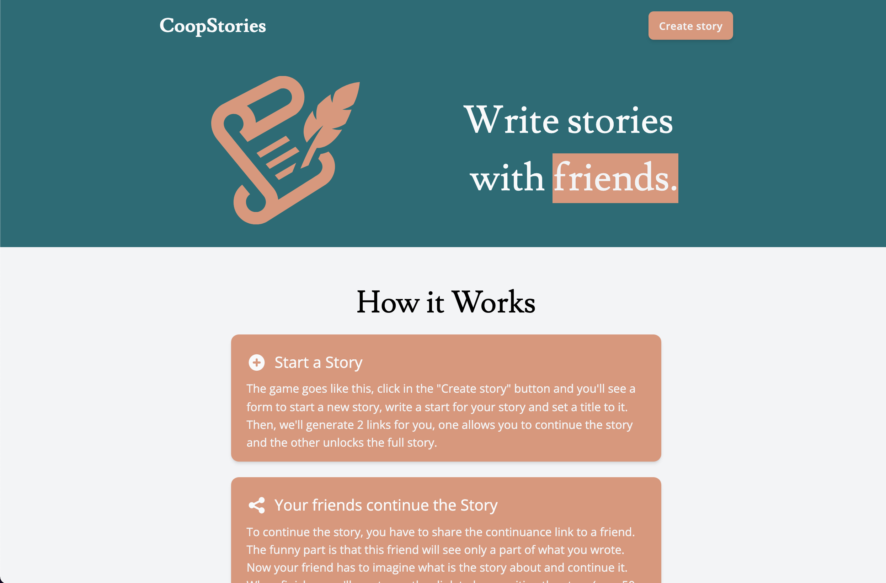

# CoopStories

[](https://github.com/coopstories/frontend/actions/workflows/deploy.yml)

Write stories with friends.



> This is repo only contains the frontend of CoopStories, you can find the backend [here.](https://github.com/coopstories/backend)

## Prerequisites

- NodeJS > v16.13.2
- Yarn
- [Backend running](https://github.com/coopstories/backend)

## Usage

```bash
# Install dependencies
yarn install

# Set environment variables
cp .env.example .env

# Start frontend
yarn start

# Open your browser on localhost:3000
```

## Deployment

The app is built using Docker. To run the frontend in production follow the steps bellow.

```bash
# 1. Build the image (specify your own BACKEND_URL)
docker build --build-arg BACKEND_URL=https://{BACKEND_URL} -t coopstories/frontend .

# 2. Start a container from this image
docker run -p 80:80 --name coopstories_frontend coopstories/frontend

# 3. The frontend is available at localhost:80
```

This only runs the frontend, for the backend you still need to do more stuff. [See backend deployment section.](https://github.com/coopstories/backend)

## About the project

This project was made for educational purposes, I wanted to try some new technologies such as:

- The combination of TS and React
- [TailwindCSS](https://github.com/tailwindlabs/tailwindcss)
- GraphQL ([urql](https://github.com/FormidableLabs/urql) as client)
- [Wouter](https://github.com/molefrog/wouter) as an alternative to React-Router

If you find anything that could be improved feel free to [open an issue](https://github.com/coopstories/frontend/issues/new) in this same repo.